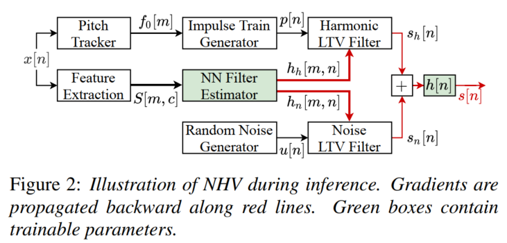

## Neural Homomorphic Vocoder (NHV)

### 源滤波器合成原理

如图[6.6](#fig:vocoder_nhv_source_filter){reference-type="ref"
reference="fig:vocoder_nhv_source_filter"}所示，基于源-滤波器的参数合成中，合成器的工作流程主要可分为三步。

1.  根据待合成音节的声调特性构造相应的声门波激励源。

2.  再根据协同发音、速度变换（时长参数）等音变信息在原始声道的基础上构造出新的声道参数模型。

3.  最后将声门波激励源送入新的声道模型中，输出就是结合给定韵律特性的合成语音。

共振峰合成和LPC（线性预测分析）合成是上述源-滤波器结构的参数合成中最常用的两种方法，实现原理类似，只是使用的声道模型不同。同时针对声道模型的特性，在源的选取上也略有区别。

### 共振峰合成方法

与线性预测方法类似，共振峰合成方法也是对声源-声道模型的模拟，但它更侧重于对声道谐振特性的模拟。它把人的声道看作一个谐振腔，腔体的谐振特性决定所发出语音信号的频谱特性，也即共振峰特性。音色各异的语音有不同的共振峰模式，用每个共振峰以及其带宽作为参数可以构成一个共振峰滤波器，将多个共振峰滤波器组合起来模拟声道的传输特性，根据这个特性对声源发生器产生的激励信号进行调制，经过辐射模型后，就可以得到合成语音。

语音学的研究结果表明，决定语音感知的声学特征主要是语音的共振峰，因此如果合成器的结构和参数设置正确，则这种方法能够合成高音质、高可懂度的语音。

1.  激励源模型

    一般共振峰合成器的激励源有三种类型：合成浊音时用周期激励序列；合成清音时用伪随机噪音；合成浊擦音时用周期激励调制的噪音。发浊音时，声带不断地张开和关闭，产生间隙的脉冲波，开始时声门闭合幅度为零，接着声门逐渐打开，幅度缓慢上升，然后快速下降，当再次降低到零之后，有一个导数不连续点，相当于声门突然关闭。因此浊音时激励函数形式有三角波、多项式波和滤波器激励响应激励函数。

2.  共振峰声道模型

    对于声道模型，声学理论表明，语音信号谱中的谐振特性（对应声道传递函数中的极点）完全由声道的形状决定，与激励源的位置无关。

### NHV概述

许多神经声码器旨在提升源-滤波器（source-filter）模型中对源（source）的建模能力，包括LPCNet、GELP和GlotGAN------通过神经网络仅建模源（比如建模线性预测的残差信号），而通过时变滤波器直接生成语音。不同于仅对源进行建模，神经源滤波器（Neural
Source-Filter，NSF）框架将经典框架中的线性滤波器替换为卷积神经网络，其中DDSP[^8]通过神经网络控制谐波加性噪声（Harmonic
plus Noise）生成音频。

NHV论文地址：[https://speechlab.sjtu.edu.cn/papers/2020/zjl00-liu-is2020.pdf](Neural Homomorphic Vocoder)。神经同态声码器（Neural
Homomorphic
Vocoder，NHV）通过线性时变滤波器对脉冲串和噪音进行滤波后生成语音。给定声学特征，神经网络通过估计时变脉冲响应的复数谱控制线性时变（Linear
Time-Varying，LTV）滤波器，并利用多尺度STFT和对抗损失函数进行训练。

### 整体结构

源-滤波器示意图如图[6.7](#fig:vocoder_nhv_arch){reference-type="ref"
reference="fig:vocoder_nhv_arch"}所示， ${e[n]}$ 表示源（source），
$h[n]$ 为滤波器， $s[n]$
则是重建的样本点。在NHV中，神经网络负责建模源-滤波器模型中的线性时变（Linear
Time-Varying，LTV）滤波器。类似于谐波噪音加性模型（Harmonic plus Noise
model），NHV分别生成谐波和噪音成分。谐波部分，主要是通过线性时变脉冲串（LTV
filtered impulse
trains）建模发音部分的周期性振动；噪音部分，包括背景噪音、不发音成分、以及发音部分中的随机成分，通过线性时变滤波噪音建模。将原始的语音信号
$x$ 和重建信号 $s$ 切分为若干个帧长 $L$ 的不重叠帧， $m$ 为帧索引， $n$
为样本点索引， $c$ 为特征索引，因此总帧数和总样本点数满足：

$$N=M\times L$$

上式中， $N$ 表示样本点总数， $M$ 表示不重叠帧帧数， $L$
表示每个帧中的样本点个数。

脉冲响应 $h$ 是因果的，谐波脉冲响应 $h_h$ 和噪音脉冲响应 $h_n$ 无限长，
$n\in \mathbb{Z}$ 。

NHV的语音生成过程如上图[6.8](#fig:vocoder_nhv_inference){reference-type="ref"
reference="fig:vocoder_nhv_inference"}所示，首先通过帧级别基频 $f_0[m]$
生成脉冲串 $p[n]$ ，从高斯分布中采样得到噪音信号 $u[n]$
；接着神经网络利用对数域梅尔谱 $S[m,c]$ 估计出每一帧的谐波脉冲响应
$h_h[m,n]$ 和噪音脉冲响应 $h_n[m,n]$ ；接着脉冲串 $p[n]$ 和噪音信号
$u[n]$ 通过LTV线性时变滤波器获得谐波成分 $s_h[n]$ 和噪音成分 $s_n[n]$
；最后， $s_h[n]$ 和 $s_n[n]$
加起来，并通过可训练的因果有限冲激响应滤波器 $h[n]$
滤波，获得最终的语音样本点 $s[n]$ 。

### 脉冲串生成器

利用低通正弦波的和生成脉冲串：

$$p(t)=\left\{\begin{array}{l}
    \sum_{k=1}^{2kf_0(t)<f_s}{\rm cos}(\int_{0}^{t}2\pi k f_0(\tau){\rm d}\tau),\quad if\ f_0(t)>0 \\ 
    0,\quad if\ f_0(t)=0
   \end{array}\right.$$

其中，通过zero-order hold或者线性插值从 $f_0[m]$ 中重建 $f_0(t)$ ，且
$p[n]=p(n/f_s)$ ， $f_s$ 为采样率。

由于加性生成时，根据采样率和帧移需要加和200个正弦函数，计算量较大，因此可以采用近似算法：将基频周期四舍五入到采样周期的倍数，此时离散脉冲序列是稀疏的，然后可以按顺序生成，一次生成一个音高。

### 神经网络滤波估计器（Neural Network Filter Estimator）

使用复数谱 $\hat{h}_h$ 和 $\hat{h}_n$ 作为冲激响应 $h_h$ 和 $h_n$
的中间表示，复数谱同时描述了幅度响应和滤波器的组延迟（group
delay），滤波器的组延迟会影响语音的音色。不同于使用线性相位或最小相位滤波器，NHV使用符合相位滤波器，从数据中学习相位特性。限制复倒谱的长度相当于限制幅度和相位响应的分辨率，这提供了控制滤波器复杂性的简单方法------神经网络只预测低频带系数，高频带谱系数设置为零。实验中，每帧预测两个10ms复数谱。实现上，无限冲激响应IIR，比如
$h_h[m,n]$ 和 $h_n[m,n]$
通过有限冲激响应FIR近似，离散傅里叶变换的窗长必须足够大，以避免混叠现象，实验中窗长设置为
$N=1024$ 。

### 线性时变（LTV）滤波器和可训练的有限冲激响应（FIRs）

FIR（有限冲激响应）常用于音频信号处理，FIR和IIR（无限冲激响应）最直观的区别就体现在结构形式上，IIR的方程中，当前的输出$y(n)$是由当前输入$x(n)$，过去输入$x(n-1),x(n-2)$和过去输出$y(n-2),y(n-1)$这三类值决定。而在FIR方程中，则没有过去输出这项。IIR的差分方程如下：

$$y(n)=\sum_{k=1}^N a_ky(n-k)+\sum_{k=0}^M b_kx(n-k)$$

而FIR的差分方程为：

$$y(n)=\sum_{k=0}^M b_k x(n-k)$$

由于IIR的当前输出受到以前输出值的影响，因此它是有反馈的，或者说输出值是递归的；而FIR就是无反馈，非递归的。

谐波部分的线性时变滤波器定义如下式所示：

$$s_h[n]=\sum_{m=0}^{M}(w_L[n-mL]\cdot p[n])*h_h[m,n]$$

卷积可以在时域和频域上应用，可训练的FIR滤波器 $h[n]$
可以应用到语音生成的最后一步，谐波部分的卷积过程如下图所示。

### 神经网络的训练

1.  多尺度STFT损失

    因为要求原始信号 $x$ 和重建信号 $s$ 的声门激励（Glottal Closure
    Instants，GCIs）完全对齐，因此在重建信号 $x[n]$ 和原始信号 $s[n]$
    之间无法施加点级损失，而多尺度STFT计算损失时允许信号间相位错位。类似于多子带MelGAN[^9]，多尺度STFT损失定义为不同参数下原始和重建幅度谱之间的L1距离之和：

    $${\rm L}_R=\frac{1}{C}\sum_{i=0}^{C-1}\frac{1}{K_i}(||X_i-S_i||_1+||{\rm log}X_i-{\rm log}S_i||_1)$$

    上式中， $X_i$ 和 $S_i$ 分别为原始信号 $x$ 和重建信号 $s$ 在参数 $i$
    设置下计算获得的幅度谱，每个幅度谱包括 $K_i$ 个值，共 $C$
    组STFT参数配置，组数越多，重建信号的混叠问题一般越少。

2.  对抗损失函数

    NHV采取合页损失函数形式：

    $${\rm L}_D=\mathbb{E}_{x,S}[{\rm max}(0,1-D(x,S))]+\mathbb{E}_{f_0,S}[{\rm max}(0,1+D(G(f_0,S),S))]$$
    $${\rm G}=\mathbb{E}_{f_0,S}[-D(G(f_0,S),S)]$$

    上式中， $D(x,S)$ 表示判别器网络， $D$ 输入原始信号 $x$ 或重建信号
    $s$ ，以及真实log域梅尔频谱 $S$ ， $f_0$ 表示基频，生成器 $G(f_0,S)$
    输出重建信号 $s$ 。

### 小结

NHV是基于源-滤波器的神经声码器，通过神经网络建模线性时变滤波器（LTV），对脉冲串和噪音进行滤波后生成语音，并结合多尺度STFT和对抗损失进行训练。