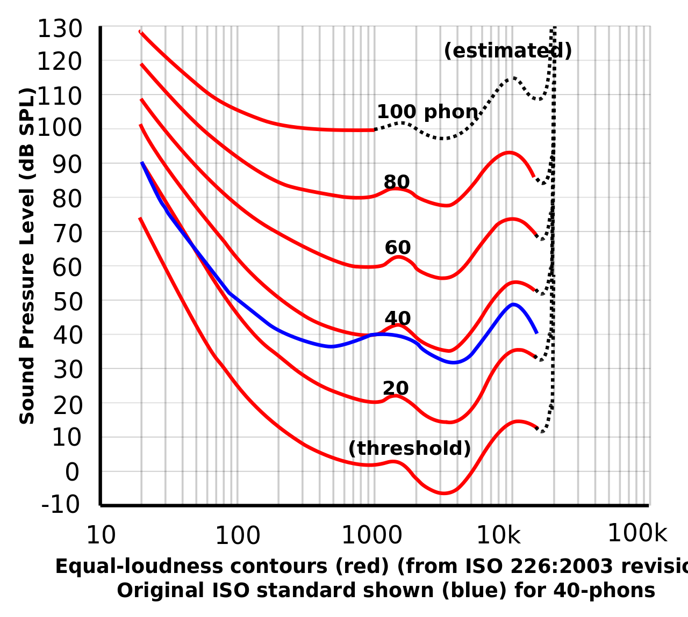
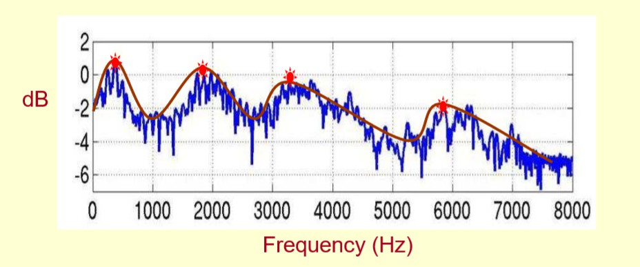

## 语音基本概念

声波通过空气传播，被麦克风接收，通过 `采样`、 `量化`、
`编码`转换为离散的数字信号，即波形文件。音量、音高和音色是声音的基本属性。

### 能量

音频的能量通常指的是时域上每帧的能量，幅度的平方。在简单的语音活动检测（Voice
Activity
Detection，VAD）中，直接利用能量特征：能量大的音频片段是语音，能量小的音频片段是非语音（包括噪音、静音段等）。这种VAD的局限性比较大，正确率也不高，对噪音非常敏感。

### 短时能量

短时能量体现的是信号在不同时刻的强弱程度。设第n帧语音信号的短时能量用
$E_n$ 表示，则其计算公式为：

$$E_n=\sum_{m=0}^{M-1}x_n^2(m)$$

上式中， $M$ 为帧长， $x_n(m)$ 为该帧中的样本点。

### 声强和声强级

单位时间内通过垂直于声波传播方向的单位面积的平均声能，称作声强，声强用I表示，单位为"瓦/平米"。实验研究表明，人对声音的强弱感觉并不是与声强成正比，而是与其对数成正比，所以一般声强用声强级来表示：

$$L=10{\rm log}(\frac{I}{I'})$$

其中，I为声强，$I'=10e^{-12}w/m^2$
称为基本声强，声强级的常用单位是分贝(dB)。

### 响度

响度是一种主观心理量，是人类主观感觉到的声音强弱程度，又称音量。`响度与声强和频率有关`。一般来说，声音频率一定时，声强越强，响度也越大。相同的声强，频率不同时，响度也可能不同。响度若用对数值表示，即为响度级，响度级的单位定义为方，符号为phon。根据国际协议规定，0dB声强级的1000Hz纯音的响度级定义为0
phon，n dB声强级的1000Hz纯音的响度级就是n
phon。其它频率的声强级与响度级的对应关系要从如图[2.1](#fig:loudness_curve){reference-type="ref"
reference="fig:loudness_curve"}等响度曲线查出。

### 过零率

过零率体现的是信号过零点的次数，体现的是频率特性。

$$Z_n=\sum_{n=0}^{N-1}\sum_{m=0}^{M-1}|{\rm sgn}(x_n(m))-{\rm sgn}(x_n(m-1))|$$

其中，$N$ 表示帧数， $M$ 表示每一帧中的样本点个数， ${\rm sgn}$
为符号函数，即

$${\rm sgn}=\left\{\begin{matrix}
    & 1,x \geq 0 \\ 
    & -1,x<0
   \end{matrix}\right.$$

### 共振峰

声门处的准周期激励进入声道时会引起共振特性，产生一组共振频率，这一组共振频率称为共振峰频率或简称共振峰。共振峰包含在语音的频谱包络中，频谱包络的局部极大值就是共振峰。频率最低的共振峰称为第一共振峰，记作$f_1$，频率更高的共振峰称为第二共振峰$f_2$、第三共振峰$f_3$......以此类推。实践中一个元音用三个共振峰表示，复杂的辅音或鼻音，要用五个共振峰。参见：[不同元音辅音在声音频谱的表现是什么样子？](https://www.zhihu.com/question/27126800/answer/35376174)，[什么是共振峰？](https://www.zhihu.com/question/24190826/answer/280149476)

### 基频和基音周期

基音周期反映了声门相邻两次开闭之间的时间间隔，基频（fundamental
frequency，f0/F0）则是基音周期的倒数，对应着声带振动的频率，代表声音的音高，声带振动越快，基频越高。它是语音激励源的一个重要特征，比如可以通过基频区分性别。一般来说，成年男性基频在100$\sim$250Hz左右，成年女性基频在150$\sim$350Hz左右，女声的音高一般比男声稍高。

如图[2.2](#fig:frequency_f0){reference-type="ref"
reference="fig:frequency_f0"}所示，蓝色箭头指向的明亮横线对应频率就是基频，决定音高；而绿框中的明亮横线统称为谐波。谐波是基频对应的整数次频率成分，由声带发声带动空气共振形成的，对应着声音三要素的音色。谐波的位置，相邻的距离共同形成了音色特征。谐波之间距离近听起来则偏厚粗，之间距离远听起来偏清澈。在男声变女声的时候，除了基频的移动，还需要调整谐波间的包络，距离等，否则将会丢失音色信息。

人类可感知声音的频率大致在20-20000Hz之间，人类对于基频的感知遵循对数律，也就是说，人们会感觉100Hz到200Hz的差距，与200Hz到400Hz的差距相同。因此，音高常常用基频的对数来表示。在音乐上，把相差一倍的两个基频的差距称为一个八度（octave）；把一个八度12等分，每一份称为一个半音（semitone）；把一个半音再100等分，每一份称为一个音分（cent）。

基频是语音的重要特征，在包括语音合成的语音处理中有着广泛的应用，比如语音转换（Voice
Conversion，VC）和语音合成中基频是一个强特征。基频的提取可以分为时域法和频域法。时域法以波形为输入，基本原理是寻找波形的最小正周期；频域法则会先对信号进行傅里叶变换，得到频谱，频谱在基频的整倍数处有尖峰，频域法的基本原理就是求出这些尖峰频率的最大公约数。但是考虑到基频并非每一帧都有，因此在提取基频前后，都需要判断有无基频，称之为清浊音判断（Unvoiced/Voiced
Decision，U/V
Decision）。语音的基频往往随着时间变化，在提取基频之前往往要进行分帧，逐帧提取的基频常常含有错误，其中常见的错误就是倍频错误和半频错误，也就是提取出来的基频是真实基频的两倍或者一半，因此基频提取后要进行平滑操作。常见的基频提取算法有基于信号处理时域法的YIN[^1]，基于信号处理频域法的SWIPE[^2]，基于机器学习时域法的CREPE[^3]和基于机器学习频域法的SPICE[^4]。常用的基频提取工具有[pyWORLD](https://github.com/JeremyCCHsu/Python-Wrapper-for-World-Vocoder)，[Parselmouth](https://github.com/YannickJadoul/Parselmouth)，[CREPE](https://github.com/marl/crepe)，[YIN](https://github.com/patriceguyot/Yin)等。参见[基频提取算法综述](https://zhuanlan.zhihu.com/p/269107205)。

### 音高

音高（pitch）是由声音的基频决定的，音高和基频常常混用。可以这样认为，音高（pitch）是稀疏离散化的基频（F0）。由规律振动产生的声音一般都会有基频，比如语音中的元音和浊辅音；也有些声音没有基频，比如人类通过口腔挤压气流的清辅音。在汉语中，元音有a/e/i/o/u，浊辅音有y/w/v，其余音素比如b/p/q/x等均为清辅音，在发音时，可以通过触摸喉咙感受和判断发音所属音素的种类。

### MFCC和语谱图

对语音进行分析和处理时，部分信息在时域上难以分析，因此往往会提取频谱特征。在语音合成中，通常将频谱作为中间声学特征：首先将文本转换为频谱，再将频谱转换为波形；在语音识别中，则将频谱或者MFCC作为中间声学特征。语音通过预加重、分帧、加窗、傅里叶变换之后，取功率谱的幅度平方，进行梅尔滤波取对数之后，就得到了梅尔频谱（或称FilterBank/FBank），如果再进行离散余弦变换，就能够获得MFCC，下一章将进行详述。语音通常是一个短时平稳信号，在进行傅里叶变换之前，一般要进行分帧，取音频的一个小片段进行短时傅里叶变换（STFT）。STFT的结果是一个复数，包括幅度和相位信息，将该复数中的频率作为横轴，幅度作为纵轴，如图[2.3](#fig:frequency_spectrum){reference-type="ref"
reference="fig:frequency_spectrum"}所示，就组成了频谱图，将频谱图中的尖峰点连接起来，就形成了频谱包络。注意到，频谱图反映一个语音帧的频域情况，没有时间信息。因此，将每个帧对应的频谱图连接起来，以时间作为横轴，频率作为纵轴，颜色深浅表示幅度，如图[2.4](#fig:frequency_time_fig){reference-type="ref"
reference="fig:frequency_time_fig"}下面红图所示，就组成了语谱图。语谱图实际上是一个三维图，横轴时间，纵轴频率，颜色深浅表示幅度大小，一般来说，颜色越深，表示幅度值越大。

