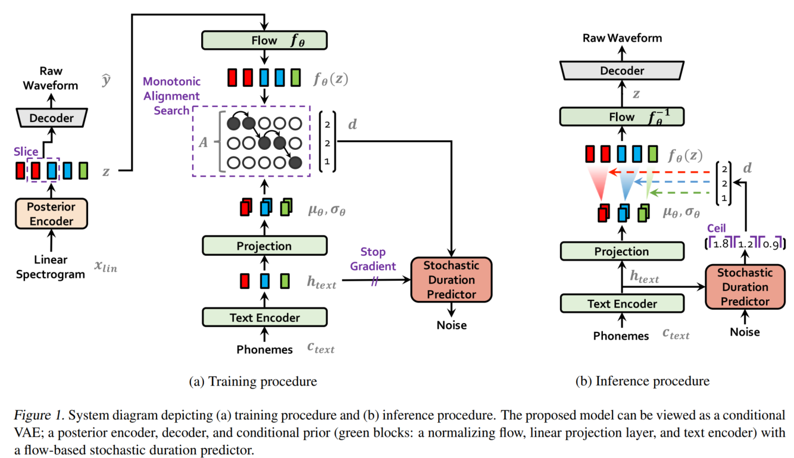

## VITS

VITS（Variational Inference with adversarial learning for end-to-end
Text-to-Speech）是一种结合变分推理（variational
inference）、标准化流（normalizing
flows）和对抗训练的高表现力语音合成模型。和Tacotron和FastSpeech不同，Tacotron
/
FastSpeech实际是将字符或音素映射为中间声学表征，比如梅尔频谱，然后通过声码器将梅尔频谱还原为波形，而VITS则直接将字符或音素映射为波形，不需要额外的声码器重建波形，真正的端到端语音合成模型。VITS通过隐变量而非之前的频谱串联语音合成中的声学模型和声码器，在隐变量上进行建模并利用随机时长预测器，提高了合成语音的多样性，输入同样的文本，能够合成不同声调和韵律的语音。VITS合成音质较高，并且可以借鉴之前的FastSpeech，单独对音高等特征进行建模，以进一步提升合成语音的质量，是一种非常有潜力的语音合成模型。

### 模型整体结构

VITS包括三个部分：

1.  后验编码器。如上图（a）的左下部分所示，在训练时输入线性谱，输出隐变量
    $z$ ，推断时隐变量 $z$ 则由 $f_\theta$
    产生。VITS的后验编码器采用WaveGlow和Glow-TTS中的非因果WaveNet残差模块。应用于多人模型时，将说话人嵌入向量添加进残差模块，`仅用于训练`。这里的隐变量
    $z$ 可以理解为Tacotron / FastSpeech中的梅尔频谱。

2.  解码器。如上图（a）左上部分所示，解码器从提取的隐变量 $z$
    中生成语音波形，这个解码器实际就是声码器HiFi-GAN
    V1的生成器。应用于多人模型时，在说话人嵌入向量之后添加一个线性层，拼接到
    $f_\theta$ 的输出隐变量 $z$ 。

3.  先验编码器。如上图（a）右侧部分所示，先验编码器结构比较复杂，作用类似于Tacotron
    / FastSpeech的声学模型，只不过VITS是将音素映射为中间表示 $z$
    ，而不是将音素映射为频谱。包括文本编码器和提升先验分布复杂度的标准化流
    $f_\theta$
    。应用于多人模型时，向标准化流的残差模块中添加说话人嵌入向量。

4.  随机时长预测器。如上图（a）右侧中间橙色部分。从条件输入 $h_{text}$
    估算音素时长的分布。应用于多人模型时，在说话人嵌入向量之后添加一个线性层，并将其拼接到文本编码器的输出
    $h_{text}$ 。

5.  判别器。实际就是HiFi-GAN的多周期判别器，在上图中未画出，`仅用于训练`。目前看来，对于任意语音合成模型，加入判别器辅助都可以显著提升表现。

### 变分推断

VITS可以看作是一个最大化变分下界，也即ELBO（Evidence Lower
Bound）的条件VAE。

1.  重建损失

    VITS在训练时实际还是会生成梅尔频谱以指导模型的训练，重建损失中的目标使用的是梅尔频谱而非原始波形：

    $${\rm L}_{recon}=||x_{mel}-\hat{x}_{mel}||_1$$

    但在推断时并不需要生成梅尔频谱。在实现上，不上采样整个隐变量 $z$
    ，而只是使用部分序列作为解码器的输入。

2.  KL散度

    先验编码器 $c$ 的输入包括从文本生成的音素 $c_{text}$
    ，和音素、隐变量之间的对齐 $A$ 。所谓的对齐就是
    $|c_{text}|\times |z|$
    大小的严格单调注意力矩阵，表示每一个音素的发音时长。因此KL散度是：

    $${\rm L}_{kl}={\rm log}q_{\phi}(z|x_{lin})-{\rm log}p_\theta (z|c_{text},A)$$

    其中， $q_{\phi}(z|x_{lin})$ 表示给定输入 $x$ 的后验分布，
    $p_\theta(z|c)$ 表示给定条件 $c$ 的隐变量 $z$ 的先验分布。其中隐变量
    $z$ 为：

    $$z\sim q_\phi(z|x_{lin})=\mathbb{N}(z;\mu_\phi(x_{lin}),\sigma_\phi(x_{lin}))$$

    为了给后验编码器提供更高分辨率的信息，使用线性谱而非梅尔频谱作为后验编码器
    $\phi_\theta$
    的输入。同时，为了生成更加逼真的样本，提高先验分布的表达能力比较重要，因此引入标准化流，在文本编码器产生的简单分布和复杂分布间进行可逆变换。也就是说，在经过上采样的编码器输出之后，加入一系列可逆变换：

    $$p_\theta(z|c)=\mathbb{N}(f_\theta(z);\mu_\theta(c),\sigma_\theta(c))|{\rm det}\frac{\partial f_\theta(z)}{\partial z}|$$

    其中，上式中的 $c$ 就是上采样的编码器输出： 
    
    $$c=[c_{text},A]$$

### 对齐估计

由于在训练时没有对齐的真实标签，因此在训练的每一次迭代时都需要估计对齐。

1.  单调对齐搜索

    为了估计文本和语音之间的对齐 $A$
    ，VITS采用了类似于Glow-TTS中的单调对齐搜索（Monotonic Alignment
    Search，MAS）方法，该方法寻找一个最优的对齐路径以最大化利用标准化流
    $f$ 参数化数据的对数似然：

    $$A=\underset{\hat{A}}{\rm argmax}{\rm log}p(x|c_{text},\hat{A})=\underset{\hat{A}}{\rm argmax}{\rm log}\mathbb{N}(f(x);\mu(c_{text},\hat{A}),\sigma(c_{text},\hat{A}))$$

    MAS约束获得的最优对齐必须是单调且无跳过的。但是无法直接将MAS直接应用到VITS，因为VITS优化目标是ELBO而非确定的隐变量
    $z$
    的对数似然，因此稍微改变了一下MAS，寻找最优的对齐路径以最大化ELBO：

    $$\underset{\hat{A}}{\rm argmax}{\rm log}p_\theta (x_{mel}|z)-{\rm log}\frac{q_\theta(z|x_{lin})}{p_\theta (z|c_{text},\hat{A})}$$

2.  随机时长预测器

    随机时长预测器是一个基于流的生成模型，训练目标为音素时长对数似然的变分下界：

    $${\rm log}p_\theta (d|c_{text}\geq \mathbb{E}_{q_\theta (u,v|d,c_{text})}[{\rm log}\frac{p_\theta (d-u,v|c_{text})}{q_\phi (u,v|d,c_{text})}]$$

    在训练时，断开随机时长预测器的梯度反传，以防止该部分的梯度影响到其它模块。音素时长通过随机时长预测器的可逆变换从随机噪音中采样获得，之后转换为整型值。

### 对抗训练

引入判别器 $D$ 判断输出是解码器 $G$ 的输出，还是真实的波形 $y$
。VITS用于对抗训练的损失函数包括两个部分，第一部分是用于对抗训练的最小二乘损失函数（least-squares
loss function）：

$${\rm L}_{adv}(D)=\mathbb{E}_{(y,z)}[(D(y)-1)^2+(D(G(z)))^2]$$

$${\rm L}_{adv}(G)=\mathbb{E}_z[(D(G(z))-1)^2]$$

第二部分是仅作用于生成器的特征匹配损失（feature-matching loss）：

$${\rm L}_{fm}(G)=\mathbb{E}_{(y,c)}[\sum_{l=1}^T\frac{1}{N_l}||D^l(y)-D^l(G(z))||_1]$$

其中， $T$ 表示判别器的层数， $D^l$ 表示第 $l$ 层判别器的特征图（feature
map）， $N_l$
表示特征图的数量。特征匹配损失可以看作是重建损失，用于约束判别器中间层的输出。

### 总体损失

VITS可以看作是VAE和GAN的联合训练，因此总体损失为：

$${\rm L}_{vae}={\rm L}_{recon}+{\rm L}_{kl}+{\rm L}_{dur}+{\rm L}_{adv}+{\rm L}_{fm}(G)$$

### 总结

VITS是一种由字符或音素直接映射为波形的端到端语音合成模型，该语音合成模型采用对抗训练的模式，生成器多个模块基于标准化流。模型较大，合成质量优异。VITS的想法相当有启发，但是理解起来确实比较难，特别是标准化流，可参考：[Awesome
Normalizing
Flows](https://github.com/janosh/awesome-normalizing-flows)。