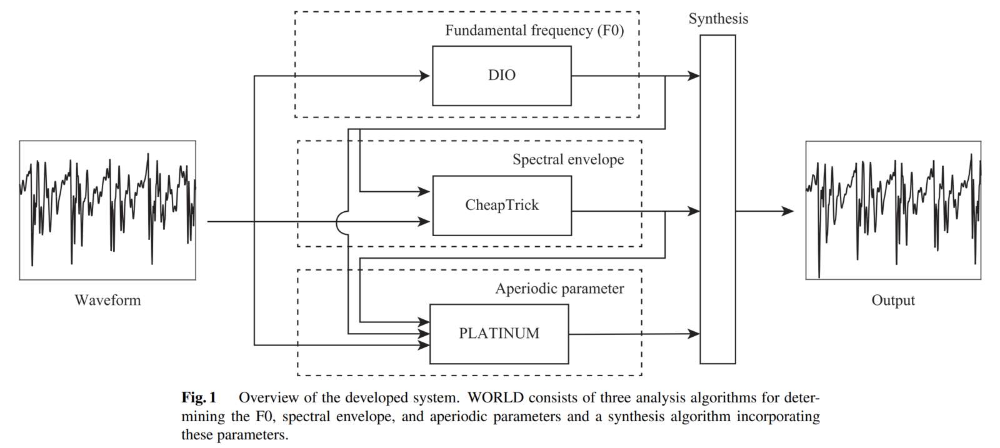
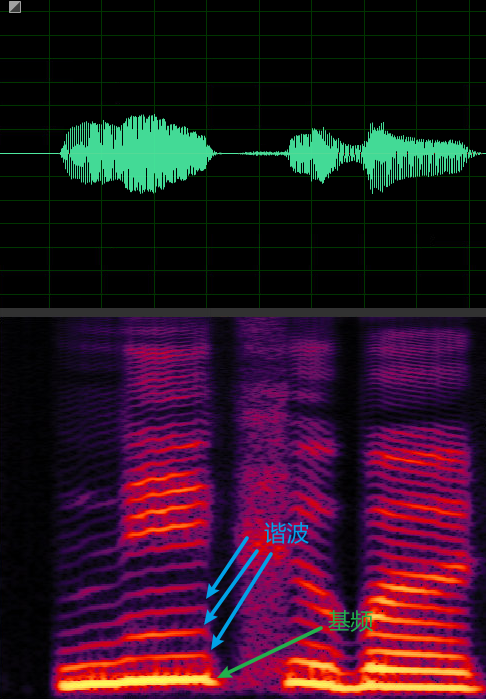
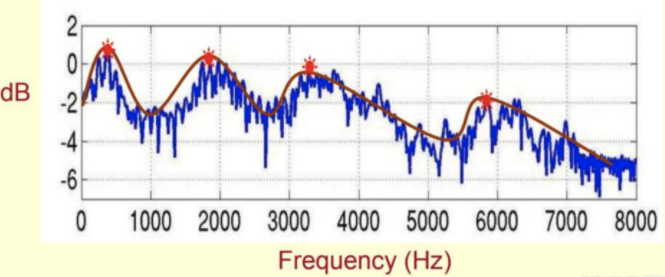
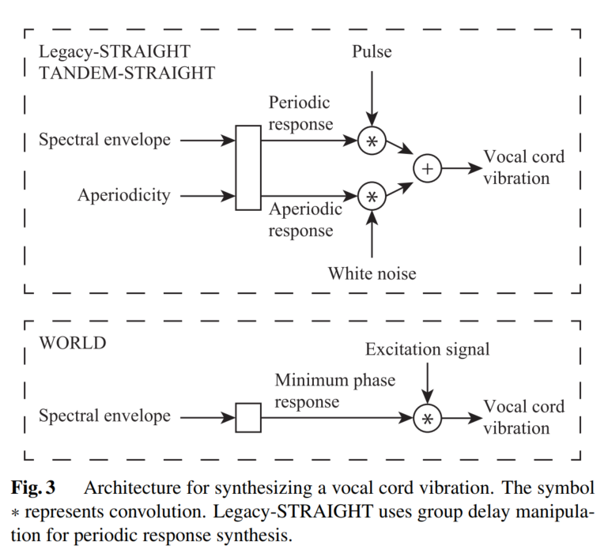

## WORLD声码器

### 声学特征

WORLD通过获取三个声学特征合成原始语音，这三个声学特征分别是：基频（fundamental
frequency，F0），频谱包络（Spectrum Envelop，也称频谱参数Spectrum
Parameter，SP）和非周期信号参数（Aperiodic Parameter，AP）。

1.  基频F0

    基频F0决定浊音，对应激励部分的周期脉冲序列，如果将声学信号分为周期和非周期信号，基频F0部分包含了语音的韵律信息和结构信息。对于一个由振动而发出的声音信号，这个信号可以看作是若干组频率不同的正弦波叠加而成，其中频率最低的正弦波即为`基频`，其它则为`泛音`。

    WORLD提取基频的流程：首先，利用低通滤波器对原始信号进行滤波；之后，对滤波之后的信号进行评估，由于滤波之后的信号应该恰好是一个正弦波，每个波段的长度应该恰好都是一个周期长度，因此通过计算这四个周期的标准差，可以评估此正弦波正确与否；最后选取标准差最小周期的倒数作为最终的基频。

2.  频谱包络SP

    频谱包络SP决定音色，对应声道谐振部分时不变系统的冲激响应，可以看作通过此线性时不变系统之后，声码器会对激励与系统响应进行卷积。将不同频率的振幅最高点通过平滑的曲线连接起来，就是频谱包络，求解方法有多种，在求解梅尔倒谱系数时，使用的是倒谱法。

    倒频谱（Cepstrum）也称为倒谱、二次谱和对数功率谱等，倒频谱的工程定义为：信号功率谱对数值进行傅里叶逆变换的结果，也就是：信号-\>求功率谱-\>求对数-\>求傅里叶逆变换。参见[信号频域分析方法的理解（频谱、能量谱、功率谱、倒频谱、小波分析）](https://zhuanlan.zhihu.com/p/34989414)。

3.  非周期信号参数AP

    非周期信号参数AP决定清音，对应混合激励部分的非周期脉冲序列，一般的语音都是由周期和非周期信号组成，因此除了上述的周期信号的声学参数，还需要非周期信号参数，才能够恢复出原始信号。混合激励可以通过AP来控制浊音段中周期激励和噪音（非周期）成分的相对比重。

### WORLD的分析功能

WORLD包含3个语音分析模块，语音分析模型包括DIO模块、CheapTrick模块，PLATINUM模块。

WORLD可以提取原始波形中的基频F0，基频包络SP和非周期信号AP，这三种声学特征对应三种提取算法：DIO输入波形提取基频，CheapTrick输入基频、波形提取频谱包络，D4C输入基频、频谱包络和波形提取非周期信号。最终，通过这三种声学特征通过最小相位谱与激励信号卷积后，输出恢复的原始波形。

### DIO算法提取基频F0

F0是周期信号最长持续时间的倒数，反过来，周期是基频的整数分之一。基频会产生二次谐波、三次谐波等，最长的周期理论上对应着频率最低的部分，也就是在语谱图上对应最下面的亮线，能量最高的部分。

有很多的算法估计基频F0，可以分为两类：一个是利用时域特征，比如自相关；一个利用频谱特征，比如倒谱cepstrum。WORLD使用DIO估计基频F0，比YIN、SWIPE要快，性能依然较好，DIO分为以下三步。

1.  低通滤波器对原始信号进行滤波。使用不同频带的低通滤波器：因为不知道基频的位置，因此这一步包含不同周期的sin低通滤波器。

2.  取4个周期计算置信度。计算获得的各个可能基频F0的置信度，因为由基频分量组成的sin信号包含4个间隔（2个顶点、2个过零点）。如果滤波器得到的间隔长度一致，则说明是一个基波，如图[6.3](#fig:vocoder_world_dio1){reference-type="ref"
    reference="fig:vocoder_world_dio1"}。

    

3.  从某个时间点的正弦波中提取出四个周期信号，并计算置信度，也就是标准差。然后选择标准差最低，也就是置信度最高的基波。

### CheapTrick算法提取频谱包络SP

声音包含不同频率的信号，覆盖0到18000Hz，每个频率都有其振幅，定义每种频率中波的振幅最高点连线形成的图形为`包络`。频谱包络是个重要的参数，在频率-振幅图中，用平滑的曲线将所有共振峰连接起来，这个平滑的曲线就是频谱包络。

提取频谱包络SP的典型算法有线性预测编码（Linear Predictive
Coding，LPC）和Cepstrum。线性预测编码LPC的原理是用若干个历史语音采样点的加权线性求和去不断逼近当前的语音采样点；Cepstrum则是基于复数倒谱拥有频谱幅度与相位信息的原理，通过对一个信号进行快速傅里叶变换FFT-\>取绝对值-\>取对数-\>相位展开-\>逆快速傅里叶变换IFFT的变换处理，从而得到对应的倒谱图。

WORLD采用CheapTrick做谱分析，思想来自于音高同步分析（pitch synchronous
analysis），其过程是：先将不同基频进行自适应加窗操作，以及功率谱平滑操作，随后将信号在频域上进行同态滤波。

### PLANTINUM提取非周期信号

混合激励和非周期信号参数AP经常应用到合成中，在Legacy-STRAIGHT和TANDEM-STRAIGHT算法中，aperiodicity被用于合成周期和非周期的信号。WORLD直接通过PLANTINUM从波形、F0和谱包络中得到混合激励的非周期信号。

### WORLD的合成算法

TANDEM-STRAIGHT直接使用周期响应计算声带的振动，而Legacy-STRAIGHT则操纵组延迟（group
delay）以避免嗡嗡声。在WORLD中，利用最小相位响应和激励信号的卷积来计算声带的振动，从下图[6.5](#fig:vocoder_world_synthesis){reference-type="ref"
reference="fig:vocoder_world_synthesis"}，可以看到，WORLD的卷积比STAIGHT要少，因此计算量更少。

### 使用示例

WORLD声码器有较为成熟的[开源实现](https://github.com/mmorise/World)，并且有对应的Python封装：[PyWORLD:
A Python wrapper of WORLD
Vocoder](https://github.com/JeremyCCHsu/Python-Wrapper-for-World-Vocoder)，另有[官方实现](http://ml.cs.yamanashi.ac.jp/world/english)。以下示例包括了通过`PyWorld`提取声学参数，合成原始音频，修改部分声学参数，编辑原始音频。

    import pyworld as pw
    from scipy.io import wavfile
    import matplotlib.pyplot as plt
    import numpy as np
    import os
    import soundfile as sf

    # 提取语音特征
    x, fs = sf.read(WAV_FILE_PATH)

    # f0 : ndarray
    #     F0 contour. 基频等高线
    # sp : ndarray
    #     Spectral envelope. 频谱包络
    # ap : ndarray
    #     Aperiodicity. 非周期性
    f0, sp, ap = pw.wav2world(x, fs)    # use default options

    # 分别提取声学参数
    # 使用DIO算法计算音频的基频F0
    _f0, t = pw.dio(x, fs, f0_floor= 50.0, f0_ceil= 600.0, channels_in_octave= 2, frame_period=pw.default_frame_period)

    # 使用CheapTrick算法计算音频的频谱包络
    _sp = pw.cheaptrick(x, _f0, t, fs)

    # 计算aperiodic参数
    _ap = pw.d4c(x, _f0, t, fs)

    # 基于以上参数合成原始音频
    _y = pw.synthesize(_f0, _sp, _ap, fs, pw.default_frame_period)

    # 1.变高频-更类似女性
    high_freq = pw.synthesize(f0*2.0, sp, ap, fs)

    # 2.直接修改基频，变为机器人发声
    robot_like_f0 = np.ones_like(f0)*100
    robot_like = pw.synthesize(robot_like_f0, sp, ap, fs)

    # 3.提高基频，同时频谱包络后移 -> 更温柔的女性？
    female_like_sp = np.zeros_like(sp)
    for f in range(female_like_sp.shape[1]):
        female_like_sp[:, f] = sp[:, int(f/1.2)]
    female_like = pw.synthesize(f0*2, female_like_sp, ap, fs)

    # 4.转换基频（不能直接转换）
    x2, fs2 = sf.read(WAV_FILE_PATH2)
    f02, sp2, ap2 = pw.wav2world(x2, fs2)
    f02 = f02[:len(f0)]
    print(len(f0),len(f02))
    other_like = pw.synthesize(f02, sp, ap, fs)